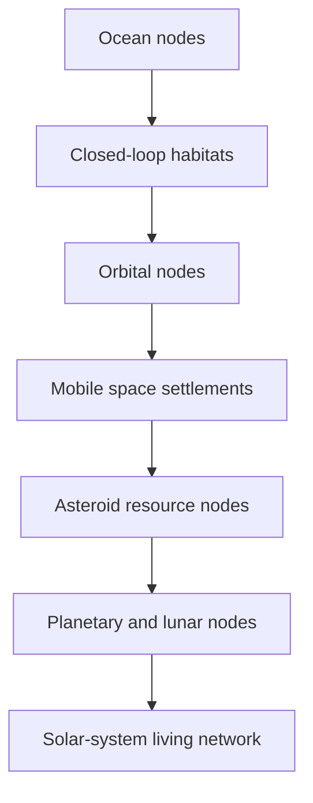

The target is not Mars. The target is **every viable volume where life can persist**.

“Beyond Earth” is too narrow; the program is **Life Expansion Beyond Its Current Habitat**:

- Earth’s oceans: surface, water column, and seabed.
    
- Earth’s atmosphere: airborne and high-altitude habitats.
    
- Subsurface Earth: resilient underground ecosystems.
    
- Earth orbit and the Earth–Moon region.
    
- The Moon and near-Earth asteroids.
    
- The full space between Earth and Mars—not merely as a transit corridor, but as occupied territory containing rotating habitats, farms, factories, depots, and mobile settlements.
    
- Mars, its moons, Venus’s upper atmosphere, and the asteroid belt.
    
- Ultimately, the entire Solar System and interstellar space.
    

The architecture is a growing mesh of nodes:

Each node may be a city, ship, station, asteroid factory, underwater settlement, or biological reserve. It becomes a genuine colony only when it can maintain life, energy, recycling, repair, governance, and reproduction despite temporary isolation.

This changes the strategy:

1. Prove self-sufficiency in oceans and other extreme Earth environments.
    
2. Build orbital habitats instead of treating orbit only as transportation.
    
3. populate useful Earth–Moon and heliocentric orbits with permanent nodes.
    
4. Convert asteroids into mines, factories, shielding, and habitat material.
    
5. Expand as a connected swarm, not through isolated planetary flags.
    
6. Introduce biological diversity progressively—from microbes and plants to complete ecosystems and humans.
    

The governing statement is:

> Colonize the continuum, not only the destinations.

Mars is one node in that continuum. The oceans are an accessible beginning, while the space between planets is itself the largest territory available for life’s expansion.